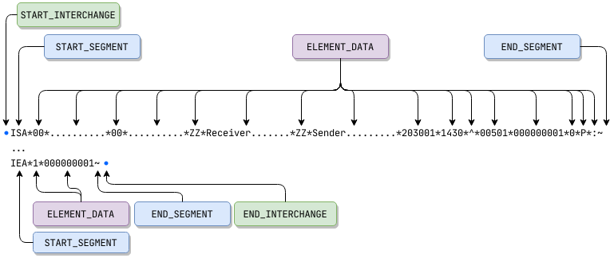

# StAEDI - Streaming API for EDI
 [](https://coveralls.io/github/xlate/staedi?branch=master) [](https://sonarcloud.io/dashboard?id=xlate_staedi) [](https://gitter.im/xlate/staedi?utm_source=badge&utm_medium=badge&utm_campaign=pr-badge&utm_content=badge) [](https://search.maven.org/artifact/io.xlate/staedi) [](https://javadoc.io/doc/io.xlate/staedi)

StAEDI is a streaming API for EDI reading, writing, and validation in Java. [[Support](https://github.com/xlate/staedi/wiki/Support) | [Wiki](https://github.com/xlate/staedi/wiki)]



The API follows the same conventions as StAX (XML API available in the standard JDK)
using a "pull" processing flow for EDI parsing and an emit flow for EDI generation.

## Features
- Support for **X12** and **EDIFACT** standards
- Read structures from an EDI stream in sequence (start loop, start segment, element data, end segment, etc.)
- EDI Schema that allows for user-specified **validation** rules
- Validation of **EDI standards** (segment occurrences, element type, element length constraints, etc.)
- Validation of **industry implementations**, for example HIPAA
- Read and write EDI data using standard Java XML interfaces (StAX)
- Support for X12 `ISX` segment (release character, element 01 only), introduced in version `007040`

## Support
Support is available to assist with incorporating StAEDI into your business's application. Available services include
- **Development of EDI validation schemas** using your documentation (e.g. PDF)
- **Integrating StAEDI** into your Java application
- **Troubleshooting issues** with your existing integration (not including StAEDI bugs - please open an issue)

Please email ***contact at xlate dot io*** for more information.

## Have a Question?
If you have a question about StAEDI that may not require the opening of an issue, please head to the StAEDI Gitter channel at https://gitter.im/xlate/staedi to discuss.

## Looking for something more?
[Fresno](https://www.xlate.io/#fresno) is an integrated EDI validation and transformation engine that supports conversion from EDI to XML and back. Data can be exchanged
using files or a REST API, easing integration with existing applications and frameworks. Advanced features include the automatic generation of acknowledgements and tracking
acknowledgements for EDI messages sent outbound. Fresno uses the same validation file format that is used in StAEDI.

More information, email subscription, and pricing can be found at [https://www.xlate.io](https://www.xlate.io/#fresno).

## Using `EDIStreamReader`
How to bootstrap the reader:
```java
// Create an EDIInputFactory
EDIInputFactory factory = EDIInputFactory.newFactory();

// Obtain an InputStream of the EDI document to read.
InputStream stream = new FileInputStream(...);

// Create an EDIStreamReader from the stream using the factory
EDIStreamReader reader = factory.createEDIStreamReader(stream);

// First event - EDIStreamEvent.START_INTERCHANGE
EDIStreamEvent event = reader.next();

// Second event - EDIStreamEvent.START_SEGMENT
event = reader.next();

// Object the event text (segment tag for EDIStreamEvent.START_SEGMENT)
String segmentName = reader.getText();

// Continue processing the stream...
```

## Maven Coordinates

```xml
<dependency>
  <groupId>io.xlate</groupId>
  <artifactId>staedi</artifactId>
  <version>1.9.4</version>
</dependency>
```

## Reading EDI

Input data is provided using a series of events via the `EDIStreamReader` class.
In addition to events such as the start of a segment or element, the looping/nested structure of the
EDI stream is represented using derived events.

```
+ Start Interchange
| +-- Start Segment (ISA/UNB)
| |     Element Data (repeats)
| +-- End Segment (ISA / UNB)
| |
| +-- Start Functional Group (Optional for EDIFACT)
| |   +-- Start Segment (GS / UNG)
| |   |     Element Data (repeats)
| |   +-- End Segment (GS / UNG)
| |
| |   +-- Start Transaction/Message
| |   |  +-- Start Segment (ST / UNH)
| |   |  |     Element Data (repeats)
| |   |  +-- End Segment (ST / UNH)
| |   |
| |   |  // Segments / Loops specific to the transaction
| |   |
| |   |  +-- Start Segment (SE / UNT)
| |   |  |     Element Data (repeats)
| |   |  +-- End Segment (SE / UNT)
| |   +-- End Transaction/Message
| |
| |   +-- Start Segment (GE / UNE)
| |   |     Element Data (repeats)
| |   +-- End Segment (GE / UNE)
| +-- End Functional Group
| |
| +-- Start Transaction/Message (EDIFACT only, if functional group(s) not used)
| |   // Same content as messages within group
| +-- End Transaction/Message
| |
| +-- Start Segment (IEA / UNZ)
| |     Element Data (repeats)
| +-- End Segment (IEA / UNZ)
+ End Interchange
```

```java
EDIInputFactory factory = EDIInputFactory.newFactory();

// Obtain Stream to the EDI document to read.
InputStream stream = new FileInputStream(...);

EDIStreamReader reader = factory.createEDIStreamReader(stream);

while (reader.hasNext()) {
  switch (reader.next()) {
  case START_INTERCHANGE:
    /* Retrieve the standard - "X12" or "EDIFACT" */
    String standard = reader.getStandard();

    /*
     * Retrieve the version string array. An array is used to support
     * the componentized version element used in the EDIFACT standard.
     *
     * e.g. [ "00501" ] (X12) or [ "UNOA", "3" ] (EDIFACT)
     */
    String[] version = reader.getVersion();
    break;

  case START_SEGMENT:
    // Retrieve the segment name - e.g. "ISA" (X12) or "UNB" (EDIFACT)
    String segmentName = reader.getText();
    break;

  case END_SEGMENT:
    break;

  case START_COMPOSITE:
    break;

  case END_COMPOSITE:
    break;

  case ELEMENT_DATA:
    // Retrieve the value of the current element
    String data = reader.getText();
    break;
  }
}

reader.close();
stream.close();

```

### Disable Validation of Control Codes

Out of the box, instances of `EDIStreamReader` will validate the control structures
of X12 and EDIFACT messages (interchange, group, and transaction headers and trailers).
This validation includes checking that some fields contain one of an enumerated list
of values (e.g. a known transaction set code in X12 segment `ST`, element 1).

If you wish to disable the validation of the code values but keep the validation of the
structure, including field sizes and types, set the `EDIInputFactory.EDI_VALIDATE_CONTROL_CODE_VALUES`
property to `false` on an instance of `EDIInputFactory` prior to creating a new `EDIStreamReader`,
as shown below.

```java
// Create an EDIInputFactory
EDIInputFactory factory = EDIInputFactory.newFactory();
factory.setProperty(EDIInputFactory.EDI_VALIDATE_CONTROL_CODE_VALUES, false);

// Obtain an InputStream of the EDI document to read.
InputStream stream = new FileInputStream(...);

// Create an EDIStreamReader from the stream using the factory
EDIStreamReader reader = factory.createEDIStreamReader(stream);

// Continue processing with the reader...
```

## Sample Writing X12 EDI

```java
EDIOutputFactory factory = EDIOutputFactory.newFactory();

// Obtain Stream write the EDI document.
OutputStream stream = new FileOutputStream(...);

EDIStreamWriter writer = factory.createEDIStreamWriter(stream);
int groupCount = 0;

writer.startInterchange();

// Write interchange header segment
writer.writeStartSegment("ISA")
      .writeElement("00")
      .writeElement("          ")
      .writeElement("00")
      .writeElement("          ")
      .writeElement("ZZ")
      .writeElement("ReceiverID     ")
      .writeElement("ZZ")
      .writeElement("Sender         ")
      .writeElement("203001")
      .writeElement("1430")
      .writeElement("^")
      .writeElement("00501")
      .writeElement("000000001")
      .writeElement("0")
      .writeElement("P")
      .writeElement(":")
      .writeEndSegment();

// Write functional group header segment
groupCount++;
writer.writeStartSegment("GS");
writer.writeStartElement();

// Continue writing remainder of functional group

writer.writeStartSegment("IEA")
      .writeElement(String.valueOf(groupCount))
      .writeElement("000000001")
      .writeEndSegment();

writer.endInterchange();

writer.close();
stream.close();
```
